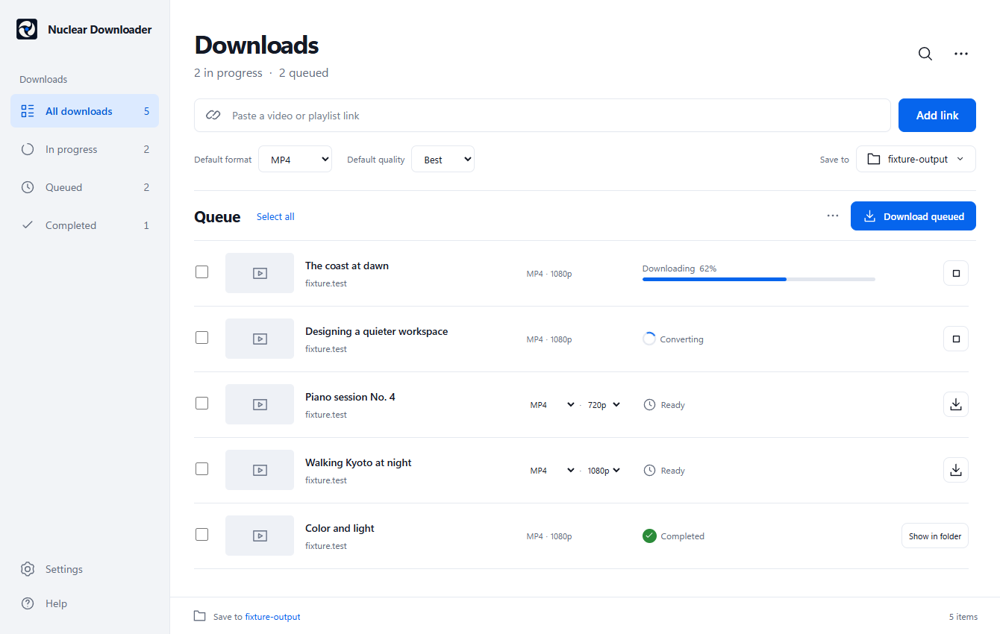
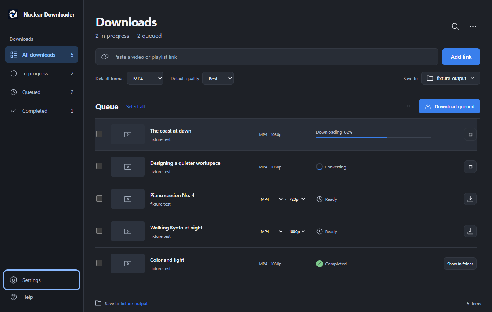

# Nuclear Downloader

[](https://github.com/HoodedBandit/nuclear-downloader/actions/workflows/ci.yml)

A Windows desktop app for downloading video and audio from YouTube, X, and other
sites supported by yt-dlp. Paste a link, choose the items, format, and quality,
then download to your chosen folder.

**Meet Clarity in 0.7.9:** a completely redesigned interface, carefully matched
light and dark themes, a new Nuclear icon, and a substantial refactor underneath.

[Download the latest release](https://github.com/HoodedBandit/nuclear-downloader/releases/latest) ·
[Changelog](CHANGELOG.md) · [Documentation](docs/README.md) ·
[Report a bug](https://github.com/HoodedBandit/nuclear-downloader/issues/new/choose) ·
[Support the project](https://ko-fi.com/hoodedbandit)



<details>
<summary>See the dark theme</summary>



</details>

Screenshots show the actual renderer with deterministic sample downloads and
placeholder thumbnails. They are not concept artwork.

## Download and run

**Target platform: Windows 11 x64.** Windows on ARM64 is not supported.

1. Open [GitHub Releases](https://github.com/HoodedBandit/nuclear-downloader/releases).
2. Choose the **x64 setup executable** for an installation, or the **x64 portable
   ZIP** and extract the entire archive into one folder.
3. Launch Nuclear Downloader. Paste a link, review its media, and add it to the queue.
4. Choose the output folder, format, and quality, then start the download.

Release bundles include the downloader and media tools. Using the app does not
require Node.js, Rust, or a command prompt. Microsoft Edge WebView2 is required
for the native window. The app's interface is embedded in its executable; it
does not run a public website or require a browser tab.

Keep the portable app and its adjacent tools together. A loose `nuclear.exe`
needs those tools or an authenticated managed runtime. The installed app can
check for published updates and hand off to a verified installer.

Official downloads, version numbers, and artifact-specific validation are listed
on the [latest release](https://github.com/HoodedBandit/nuclear-downloader/releases/latest).
Use the setup executable for a normal installation or the portable ZIP for a
self-contained folder. The Windows installer is not Authenticode-signed;
authenticated update manifests and SHA-256 checksums protect the updater path.

## Features

- Single videos, supported playlists, and individual media from multi-video posts.
- MP4, MKV, and WebM video; MP3, FLAC, WAV, AAC, and Opus audio.
- Light, Dark, and System appearance options, saved across restarts.
- Sidebar filters, search, selection, and a compact download queue.
- Per-item format and quality choices; click a prepared file title to rename it,
  including while it is waiting behind active downloads.
- Progress, speed, ETA, conversion status, cancellation, and explicit retry.
- Saved queues and recent operation history across restarts. Interrupted work stays
  paused until you choose to retry.
- Collision-safe output names that preserve files already in the destination.
- Optional browser cookies or a `cookies.txt` file for content your account can access.
- Settings brings together download access, runtime health, app/tool updates,
  redacted diagnostics, and detailed session errors.
- A red Settings notification dot marks new errors and clears automatically when
  Settings opens. Main-screen messages stay brief.

Five downloads can run concurrently, with one inspection and one explicit WebM
conversion at a time. Large queues use virtual rows and playlists use pages to
keep the interface responsive.

## What changed in 0.7.9

The Clarity redesign rebuilds the everyday experience: a dedicated sidebar,
cleaner typography and spacing, focused queue controls, a new icon across the app
and Windows shell, and a dark theme designed alongside the light theme.

- Session recovery, filename editing, filtering/selection, queue presentation,
  and error reporting have focused typed owners. Retired UI implementations and
  obsolete architecture exceptions are removed.
- Filename editing supports click or keyboard activation, Enter, Escape, and
  blur. Failed saves retain the draft; downloads wait for the affected edit.
- Waiting-item renames and worker claims share an atomic backend boundary, so
  a download cannot silently start with an unintended name.
- Connection recovery restores controls without losing error history. Tool
  refreshes preserve update failures, and rejected file dialogs reach Settings.
- Playlist admission is durable and batched; metadata preparation is bounded.
  Concurrent downloads can safely initialize their shared staging directory.

See the [Clarity changes and QC](docs/clarity-0.7.9.md),
[changelog](CHANGELOG.md), and [frontend ownership map](docs/frontend-ownership.md).
Preview checks and older soak records belong to their recorded builds; the
signed release pipeline independently tests the official installer and portable
artifacts. Each release states its remaining manual qualification work.

## Build from source

The source is available under the repository's [license](LICENSE); it is not
open-source. Development requires:

- Windows 11 x64 and PowerShell 7.
- Node.js **22.23.1** and npm **10.9.9**.
- Rust **1.94.1** through rustup, plus Visual Studio Build Tools with the C++ workload.
- Microsoft Edge WebView2; Python 3 for architecture and source-review checks.

From the repository root:

```powershell
pwsh -NoProfile -File .\scripts\fetch-sidecars.ps1
cd nuclear-app
npm ci
npm run tauri dev
```

The fetcher verifies the exact inputs recorded in
[`sidecars.lock.json`](nuclear-app/src-tauri/sidecars.lock.json). Third-party
executables are not stored in Git.

| Tool             | Current source pin |
| ---------------- | ------------------ |
| yt-dlp           | 2026.08.19         |
| FFmpeg / ffprobe | 8.1                |
| Deno             | 2.9.2              |

See [developer setup](docs/quickstart.md) for local builds and
[testing](docs/testing.md) for the complete checks, isolated renderer profiles,
visual comparisons, performance measurements, and native acceptance.

For a packaged local Windows GUI, use the single guarded command in
[local packaged build](docs/local-packaged-build.md). It creates a unique owned
target directory and a receipt for the exact executable, installer, and sidecar
bytes. A plain `cargo build --release` does not produce a qualified packaged GUI.

## Code and contribution guide

| Area                                        | Starting point                                                                                                        |
| ------------------------------------------- | --------------------------------------------------------------------------------------------------------------------- |
| Page composition and lifecycle wiring       | [`+page.svelte`](nuclear-app/src/routes/+page.svelte)                                                                 |
| Frontend state, controllers, and components | [Frontend ownership map](docs/frontend-ownership.md)                                                                  |
| Rust commands and application wiring        | [`lib.rs`](nuclear-app/src-tauri/src/lib.rs)                                                                          |
| State, lifecycle, downloads, and updates    | [Backend ownership map](docs/backend-maintainability.md)                                                              |
| Behavior and regression obligations         | [Feature checklist](docs/backend-feature-preservation.md) and [frontend baseline](docs/frontend-behavior-baseline.md) |
| Method reviews and architecture rules       | [Review ledger workflow](docs/backend-method-review-schema.md)                                                        |
| Candidate construction and publication      | [Release process](docs/release-process.md)                                                                            |

Bug reports should include the app/runtime version, source site, selected
format/quality, reproduction steps, and redacted error details. Never attach
cookies, tokens, account credentials, or private media links. See
[CONTRIBUTING.md](CONTRIBUTING.md) before proposing code changes.

## Site support and responsible use

Site support follows yt-dlp and can change when a site changes. Login-required,
private, or region-restricted media may require valid cookies and may still be
unavailable. Supporting an extractor does not guarantee every link will work.

Use the app only for content you have the right to access and download, in
accordance with applicable laws and platform terms. Do not use it to infringe
copyright or bypass access controls you are not authorized to bypass.

## License

All rights are reserved. You may not use, copy, modify, or distribute the source
without explicit written permission from the author. See [LICENSE](LICENSE).
